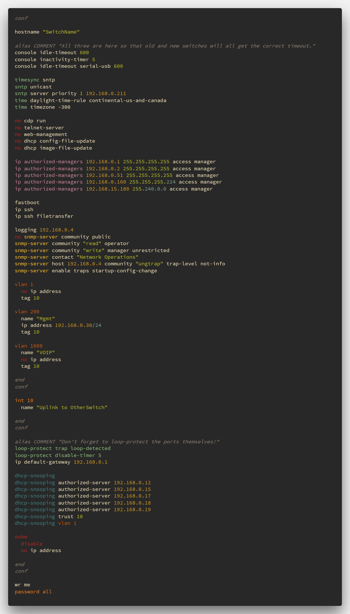

# vscode-procurve-syntax

Visual Studio Code syntax highlighting for HP/Aruba Procurve switch configurations

### Syntax Coloring for:

* Comments
* DHCP Snooping
* General numbers
* IGMP
* Interface
* IP Authorized Managers
* IPv4 Addresses with/without subnet
* Loop Protection
* No and Disable
* OOBM
* Passwords
* SNMP
* SNTP & Time
* Spanning-Tree
* Speed-Duplex
* Tagged
* Trunk
* Untagged
* VLAN

